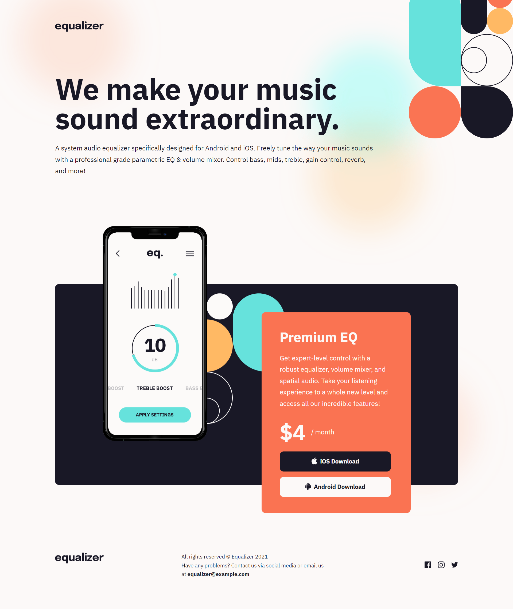

# Frontend Mentor - Equalizer landing page solution

This is a solution to the [Equalizer landing page challenge on Frontend Mentor](https://www.frontendmentor.io/challenges/equalizer-landing-page-7VJ4gp3DE). Frontend Mentor challenges help you improve your coding skills by building realistic projects. 

## Table of contents

- [Overview](#overview)
  - [The challenge](#the-challenge)
  - [Screenshot](#screenshot)
  - [Links](#links)
- [My process](#my-process)
  - [Built with](#built-with)
  - [What I learned](#what-i-learned)
  - [Continued development](#continued-development)
- [Author](#author)
- [Acknowledgments](#acknowledgments)

## Overview

### The challenge

Users should be able to:

- View the optimal layout depending on their device's screen size
- See hover states for interactive elements

### Screenshot

### Links

- Solution URL: [https://www.frontendmentor.io/solutions/equalizer-landing-page-responsive-with-media-queries-YCqK8_UI47](https://www.frontendmentor.io/solutions/equalizer-landing-page-responsive-with-media-queries-YCqK8_UI47)
- Live Site URL: [https://sircarloschaves.github.io/equalizer-landing-page/](https://sircarloschaves.github.io/equalizer-landing-page/)

## My process

### Built with

- Semantic HTML5 markup
- CSS custom properties
- Flexbox
- CSS Grid
- Mobile-first workflow

### What I learned

I learned how to position sections and components in the layout in different ways.

### Continued development

I will continue practicing different layouts so that I can get as close as possible to the original layout and make it pixel perfect.

## Author

- Github - [sircarloschaves](https://github.com/sircarloschaves)
- Frontend Mentor - [@sircarloschaves](https://www.frontendmentor.io/profile/sircarloschaves)
- Twitter/X - [@carloschavesdev](https://twitter.com/carloschavesdev)